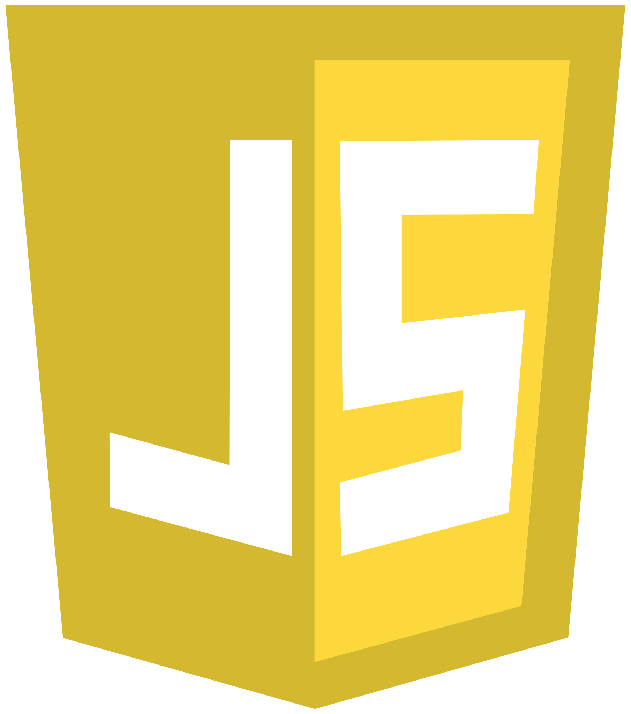

# 👋 Olá, Sou Maurílio!

### Aqui você encontrará meus projetos, habilidades e contribuições!
### Analista de Suporte e DBA com foco em automações, scripts e controle de sistemas. Atuando com organização de processos técnicos e manutenção de bases.

---

## 📈 Estatísticas do GitHub

---

## 🛠️ Tecnologias e Ferramentas

  
  
  
  
  

---

## 📚 Banco de Dados

  
  
  
  

---

## 💭 Vamos Conversar!

Sinta-se à vontade para me contatar para colaborações, feedbacks ou apenas para um papo sobre tecnologia! Estou sempre aberto a novas oportunidades e conexões.

#### 📠Fortaleza |   
